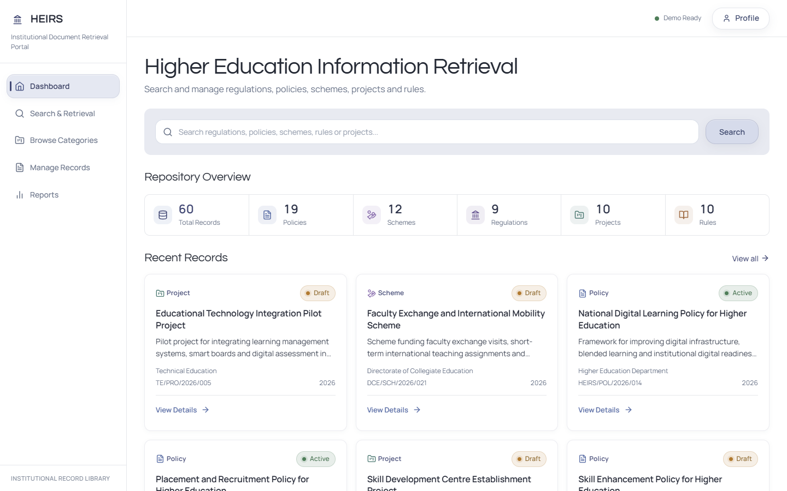
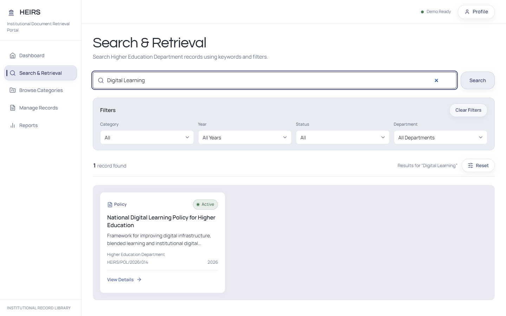
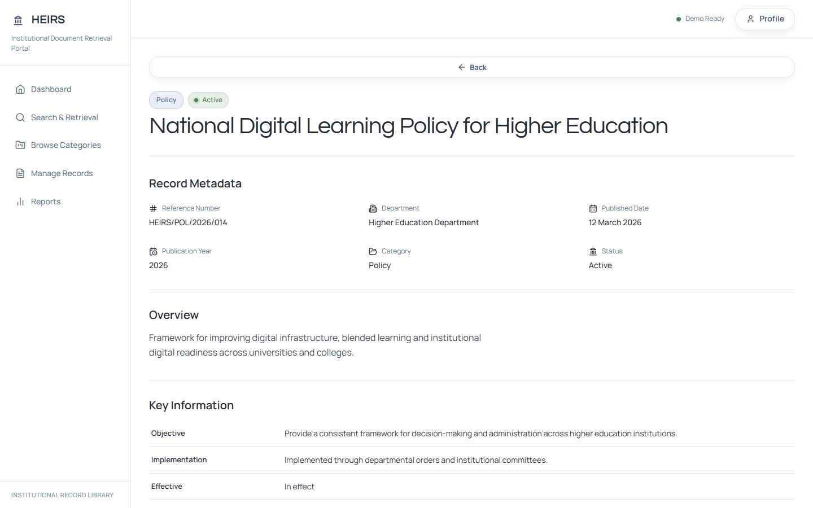
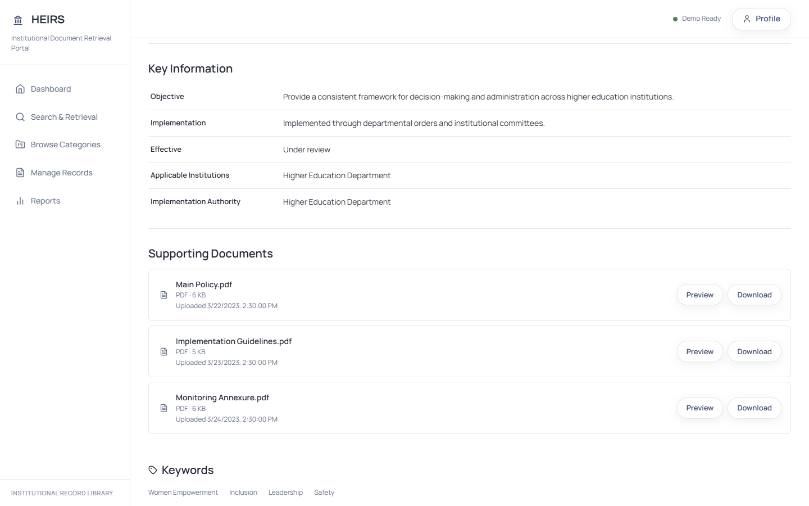
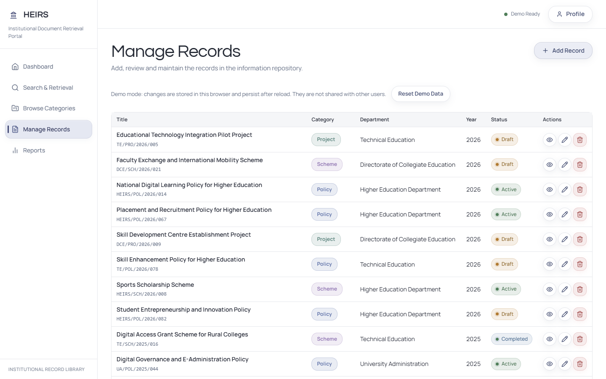
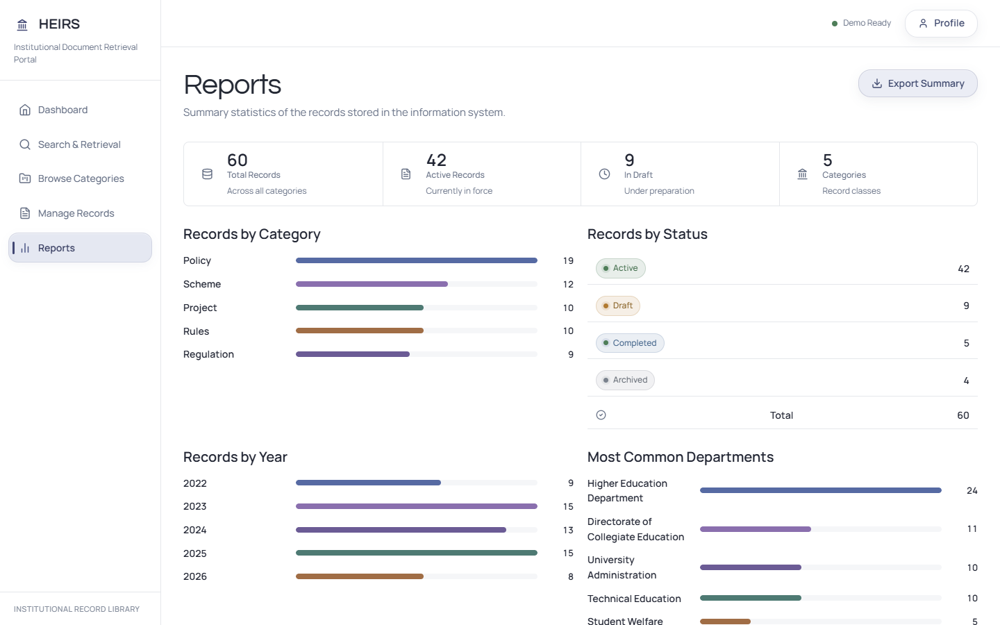
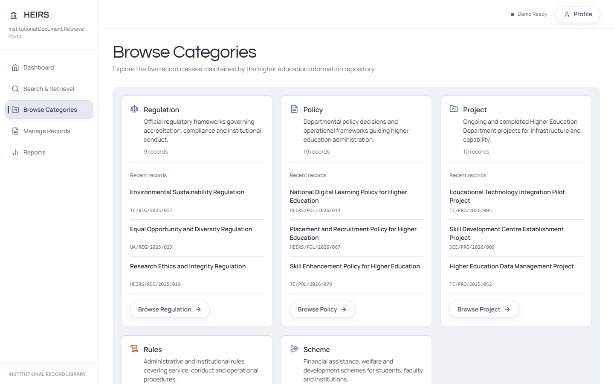

# HEIRS — Higher Education Information Retrieval System

A web-based information retrieval system for organizing, searching, managing, and accessing higher-education regulations, policies, schemes, projects, rules, and supporting documents.

## Live Demo

[Open HEIRS Demo](https://heirs-azure.vercel.app/)

The deployed version runs in frontend demo mode using bundled demo data and browser-local persistence. The real Spring Boot + MySQL mode is intended for local full-stack use.

## Project Overview

HEIRS centralizes higher-education-related records such as:

- Policies
- Schemes
- Regulations
- Projects
- Rules

Users can:

- Search records by keyword, department, and metadata
- Filter and browse by category
- View detailed record pages
- Preview and download supporting PDF documents
- Manage demo records (CRUD)
- View dashboard and reports

## Key Features

- Keyword-based and multi-filter search
- Category browsing
- Record detail pages with metadata
- Record CRUD (create, update, delete)
- Multi-document management per record
- PDF preview and download
- Dashboard overview
- Reports and analytics
- Dual data mode (full-stack API / frontend-only demo)
- Frontend-only Vercel demo (no backend required)
- Local full-stack mode with Spring Boot + MySQL

## Architecture

Two distinct runtime modes are supported via a single environment variable.

### Local Full-Stack Mode

```
React
  → Spring Boot REST API
  → MySQL
  → local document storage
```

### Public Demo Mode

```
Vercel (or local Vite preview)
  → React / Vite
  → bundled demo records
  → browser localStorage
  → bundled demo PDFs
```

## Tech Stack

**Frontend**
React, Vite, JavaScript, CSS

**Backend**
Java, Spring Boot, Spring Data JPA, REST API

**Database**
MySQL

**Deployment**
Vercel (frontend demo)

**Tooling**
Maven Wrapper (`mvnw`), Git / GitHub

## Demo Dataset

The bundled demo set includes:

- 60 curated demo records across five categories
- 137 generated synthetic supporting PDFs
- every bundled record has 2–3 supporting documents
- all synthetic content is generated strictly for project demonstration

## Demo Disclaimer

The bundled PDF documents and record content used in the public demo are synthetic and created only for demonstration of the HEIRS project. They are not official government orders, policies, schemes, rules, regulations, or legal documents.

## Project Structure

```
Higher-Education-Information-Retrieval-System/
├── frontend/               # React / Vite SPA
│   ├── src/
│   │   ├── data/           # records, documents, providers
│   │   ├── pages/          # Dashboard, Search, Reports, Admin, etc.
│   │   └── components/     # UI components
│   └── public/
│       └── demo-documents/ # bundled synthetic PDFs
├── backend/                # Spring Boot application
│   ├── src/main/java/
│   │   ├── controller/     # REST controllers
│   │   ├── service/        # business logic
│   │   ├── repository/     # JPA repositories
│   │   ├── entity/         # persistence entities
│   │   └── dto/            # data transfer objects
│   └── pom.xml
├── scripts/                # demo document generator (Python)
│   ├── generate_demo_documents.py
│   ├── content_engine.py
│   ├── pdf_renderer.py
│   └── extract_records.mjs
└── README.md
```

## Running Locally

### API Mode (Full Stack)

```bash
# terminal 1 — backend
cd backend
mvnw.cmd spring-boot:run

# terminal 2 — frontend
cd frontend
cp .env.example .env   # ensure VITE_DATA_MODE=api
npm install
npm run dev
```

Requires Java 17+, a running MySQL instance, and a valid `application.properties` in the backend. Frontend runs at `http://localhost:5173`.

### Demo Mode (Frontend Only)

```bash
cd frontend
cp .env.example .env
# set VITE_DATA_MODE=demo in .env
npm install
npm run dev
```

No Spring Boot or MySQL required. All data lives in the browser's localStorage and resets only when the user clears site data or uses the Reset Demo action.

## Screenshots

### Dashboard



### Search & Retrieval



### Record Details



### Supporting Documents



### Manage Records



### Reports



### Browse Categories



## Current Status

- [x] React frontend — complete
- [x] Spring Boot backend — complete
- [x] MySQL integration — complete
- [x] Multi-document management — complete
- [x] Frontend demo mode — complete
- [x] Vercel deployment — complete
- [x] Synthetic supporting documents — complete
- [ ] JavaFX desktop client — next phase

## Next Phase

**JavaFX Desktop Admin Client**

Planned architecture:

```
JavaFX GUI
  → same Spring Boot REST API
  → same MySQL database
```

The JavaFX client will provide an offline-capable desktop interface for administrative tasks, sharing the same backend as the web application.
